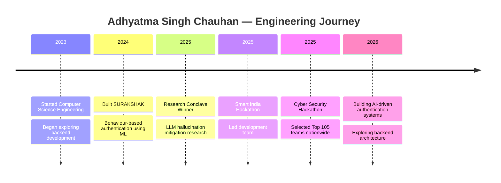

## Engineering Philosophy

I enjoy building intelligent and secure systems that solve real-world problems.  
My work combines **AI-driven decision systems, backend engineering, and security-focused architecture**.I approach development from a **systems perspective**—designing solutions that are scalable, automated, and resilient.

Most of my current projects explore areas like:
- AI-based authentication
- Behavioural security models
- Automated verification systems
- Backend architecture for intelligent applications

## Current Engineering Focus

- Designing AI-driven authentication systems
- Studying backend architecture for scalable systems
- Researching security mechanisms in intelligent applications
- Exploring real-world uses of machine learning in authentication

## Technology Stack

**Languages**
Java • JavaScript • Python

**Web Development**
HTML • CSS • React

**Backend**
Node.js • REST APIs • JWT Authentication

**Databases**
MongoDB • Firebase

**Tools**
Git • GitHub • Postman • VS Code

## GitHub Analytics

## Contribution Activity

## Contribution Activity

## ⚙️ Tech Stack

## Engineering Timeline

