<!-- ========================================================= -->

<!--                    CYBER README v2.0                      -->

<!--               Adhyatma Singh Chauhan (ASC006)             -->

<!-- ========================================================= -->

  

  

---

<h2>About Me</h2>

<ul>
<li>Building AI-powered software that solves real-world security challenges.</li>
<li>Passionate about Intelligent Systems, Backend Engineering, and Machine Learning.</li>
<li>Open Source contributor who enjoys transforming ideas into production-ready products.</li>
<li>Always exploring better architectures, cleaner code, and scalable solutions.</li>
</ul>

</td>

<td width="42%" align="right">

</td>

</tr>
</table>

---

    

---

    

---

    

---
---

    

---

## Contribution Activity

---

---

  

  
  &nbsp;
  
  &nbsp;
  
  &nbsp;
  
  &nbsp;
  

---
---

<!-- ========================================================= -->

<!--                  END OF README                            -->

<!-- ========================================================= -->
