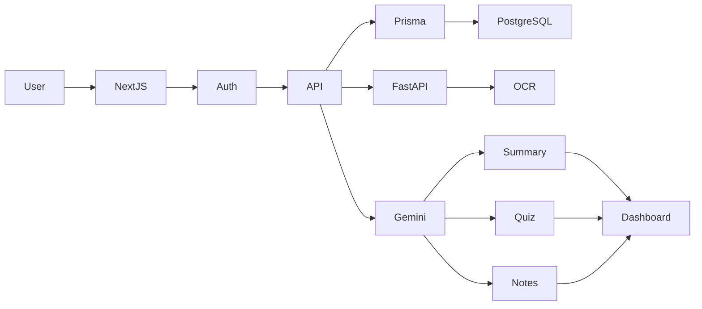
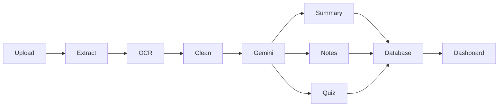

# NeuroLearn

[](https://YOUR-WEBSITE-URL)
[](https://nextjs.org)
[](https://react.dev)
[](https://prisma.io)
[](https://postgresql.org)
[](https://fastapi.tiangolo.com)
[](https://aistudio.google.com)

AI-powered learning platform that transforms PDF documents into summaries, notes, quizzes, knowledge maps, and interactive study materials.

---

## Features

- PDF Upload & Processing
- AI Generated Summaries
- Smart Notes
- Quiz Generation
- Knowledge Maps
- Context-Aware AI Chat
- Google OAuth Authentication
- Learning Analytics Dashboard

---

## Architecture



---

## Document Processing Pipeline



---

## Tech Stack

### Frontend

- Next.js 16
- React 19
- Tailwind CSS
- Framer Motion
- D3.js
- Recharts

### Backend

- Next.js API Routes
- FastAPI

### Database

- PostgreSQL
- Prisma ORM
- Neon Database

### AI

- Google Gemini 2.0 Flash
- PyMuPDF
- pdfplumber
- Tesseract OCR

### Authentication

- NextAuth.js
- Google OAuth

---

## Project Structure

```text
src/
├── app/              # Next.js routes
├── components/       # UI components
├── lib/              # Shared utilities
├── types/            # Type definitions

prisma/
├── schema.prisma
├── migrations/

server/
├── main.py
├── requirements.txt
```

---

## Local Setup

### Clone Repository

```bash
git clone https://github.com/YOUR_USERNAME/NeuroLearn.git
cd NeuroLearn
```

### Install Dependencies

```bash
npm install

cd server
pip install -r requirements.txt
cd ..
```

### Configure Environment

```bash
cp .env.example .env
```

Required variables:

```env
DATABASE_URL=
NEXTAUTH_URL=
NEXTAUTH_SECRET=

GOOGLE_CLIENT_ID=
GOOGLE_CLIENT_SECRET=
GOOGLE_API_KEY=

FASTAPI_URL=
NEXT_PUBLIC_AI_SERVICE_URL=
```

### Prisma Setup

```bash
npx prisma db push
npx prisma generate
```

### Start Development Servers

Terminal 1

```bash
npm run dev
```

Terminal 2

```bash
cd server
python main.py
```

Application:

```text
http://localhost:3000
```

---

## Security

- CSRF Protection
- Rate Limiting
- Input Validation using Zod
- Password Hashing with bcrypt
- Protected API Routes

---

## License

MIT License

---

## Author

**Adhyatma Singh Chauhan**

GitHub: https://github.com/asc006-git
