<!-- ========================================================= -->

<!--                    CYBER README v2.0                      -->

<!--               Adhyatma Singh Chauhan (ASC006)             -->

<!-- ========================================================= -->

<p align="center">
  
</p>

<p align="center">
  
</p>

---

<h2>About Me</h2>

<ul>
<li>Building AI-powered software that solves real-world security challenges.</li>
<li>Passionate about Intelligent Systems, Backend Engineering, and Machine Learning.</li>
<li>Open Source contributor who enjoys transforming ideas into production-ready products.</li>
<li>Always exploring better architectures, cleaner code, and scalable solutions.</li>
</ul>

</td>

<td width="42%" align="right">


</td>

</tr>
</table>

---

<p align="center">
    
</p>

---

<p align="center">
    
</p>

---

<p align="center">
    
</p>

---
---

<p align="center">
    
</p>

---

## 📈 Contribution Activity

<p align="center">


</p>

---

## 📌 Pinned Projects

<table>
<tr>

<td width="50%">

<a href="https://github.com/asc006-git/VoiceShield-AI">

</a>

</td>

<td width="50%">

<a href="https://github.com/asc006-git/HalluciGuard">

</a>

</td>

</tr>

<tr>

<td width="50%">

<a href="https://github.com/asc006-git/NeuroLearn">

</a>

</td>

<td width="50%">

<a href="https://github.com/ananyadhagat/Suraksha">

</a>

</td>

</tr>

</table>

---

<p align="center">
    
</p>

---

<div align="center">

<a href="https://www.linkedin.com/in/adhyatma006">

</a>

 

<a href="https://github.com/asc006-git">

</a>

 

<a href="https://leetcode.com/u/asc_006/">

</a>

 

<a href="https://codeforces.com/profile/Adhyatma_27">

</a>

 

<a href="mailto:adhyatma006@gmail.com">

</a>

</div>

---

<p align="center">
    
</p>

<div align="center">

```java
public class Developer {

    public static void main(String[] args) {

        while (curious()) {

            learn();

            build();

            innovate();

            contribute();

        }

    }

}
```


</div>

<!-- ========================================================= -->

<!--                  END OF README                            -->

<!-- ========================================================= -->
