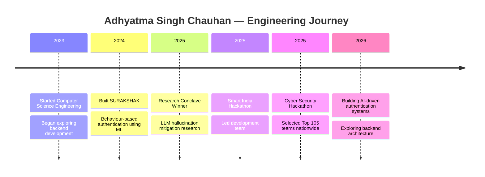

## About Me

Computer Science Engineering student focused on building **AI-driven and security-focused systems**.
I enjoy designing **scalable backend architectures and intelligent authentication systems** that solve real-world problems.My work spans **AI verification systems, behavioural security models, and full-stack development**, with experience from hackathons, research competitions, and real project builds.

Currently exploring **backend system design and machine-learning-based security solutions.**
Most of my current projects explore areas like:
- AI-based authentication
- Behavioural security models
- Automated verification systems
- Backend architecture for intelligent applications

## GitHub Analytics

## Contribution Activity

## Tech Stack

## Engineering Timeline

## Connect With Me

