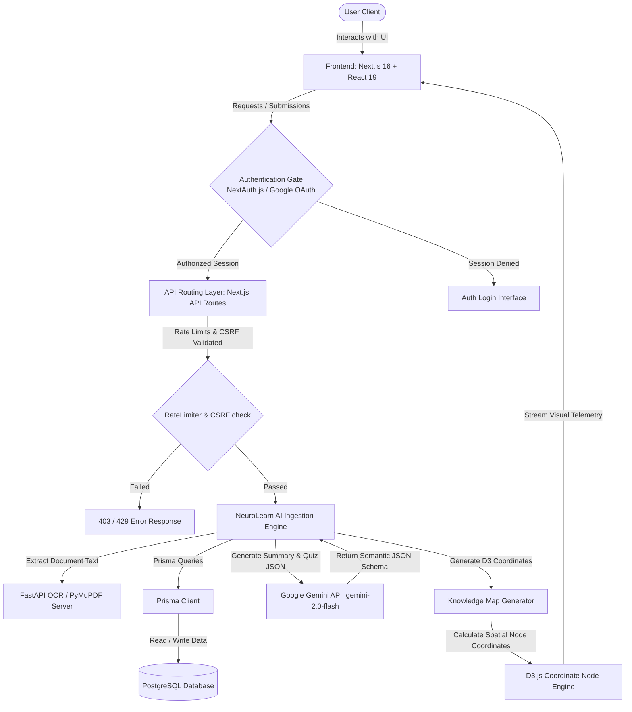
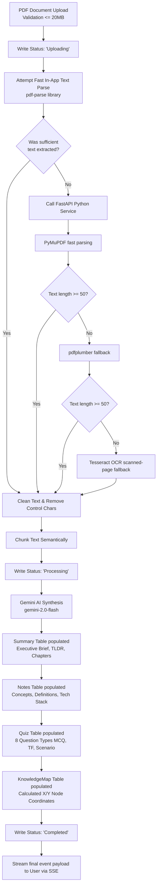

# NeuroLearn 

> Cinematic AI-Powered Document Comprehension & Active Recall Learning System

[](https://nextjs.org/)
[](https://react.dev/)
[](https://tailwindcss.com/)
[](https://www.prisma.io/)
[](https://www.postgresql.org/)
[](https://fastapi.tiangolo.com/)
[](https://aistudio.google.com/)
[](https://opensource.org/licenses/MIT)

NeuroLearn AI is a full-stack learning platform designed to ingest unstructured PDF documents (textbooks, research papers, reports) and automatically synthesize them into dynamic, interactive study guides. Built with **Next.js 16**, **React 19**, and a standalone **FastAPI document service**, the application features real-time progress tracking, visual concept relationship mapping, active recall assessments, and a context-aware chat assistant.

---

## Project Summary

**NeuroLearn**
*Developed a cinematic AI-driven document comprehension and active recall system.*
- **Ingestion & Text Processing**: Engineered a robust document pipeline combining a Next.js server side text parser with a FastAPI microservice implementing PyMuPDF, pdfplumber, and Tesseract OCR fallbacks for scanned documents.
- **AI Core Integration**: Integrated Google Gemini API (`gemini-2.0-flash`) via structural JSON schemas to synthesize summaries, extract conceptual definitions, and compile active recall assessments.
- **Hybrid NLP Fallback**: Authored an extractive local NLP fallback engine performing structural layout analysis, entity frequency detection, and sentence scoring to maintain full system functionality offline.
- **Data Visualization**: Architected an interactive 2D spatial coordinate mapping generator using D3.js and Recharts, translating document concepts and tech stacks into a connected visual knowledge graph.
- **Security & Infrastructure**: Implemented cryptographic timing-safe CSRF validations, sliding-window rate-limiting, and multi-stage Docker configurations orchestrating Next.js, Python, and PostgreSQL.

---

## ✨ Key Highlights

- **Real-Time Pipeline Status**: Streams ingestion logs (Uploading → Extracting → Processing → Summaries → Notes → Quizzes) to the browser using Server-Sent Events (SSE).
- **Extensive Knowledge Graphing**: Spatially maps concepts, architectures, and technologies into interactive SVG coordinate maps.
- **Active Recall Engine**: Generates 8 distinct question types (MCQs with explanations for wrong answers, Fill-in-the-Blank, True/False, Scenarios, and Applications).
- **Grounding Chat Assistant**: Integrates user notes and document contents directly into the system prompts to ensure responses are fully grounded in the materials.

---

## 📸 Interface Showcases

| Dashboard Hub | Interactive Knowledge Map |
| :---: | :---: |
| <br>*Ingestion & Telemetry Dashboard* | <br>*D3 Conceptual Graph visualization* |

| Smart Study Notes | Active Recall Studio |
| :---: | :---: |
| <br>*Concept Cards & Revision Notes* | <br>*Dynamic multi-format assessments* |

---

## 🎨 Feature Showcase Cards

```carousel
### 📂 Ingestion Pipeline
- **Parallel Fallbacks**: Routes PDF content through localized parsers, falling back to deep Tesseract OCR analysis if a scanned PDF is detected.
- **SSE Telemetry**: Continuously pushes real-time pipeline status steps straight to the UI.
- **Binary Recovery**: Stores raw PDF bytes in PostgreSQL so documents can be reprocessed without requiring re-upload.
<!-- slide -->
### 🕸️ Knowledge Maps
- **2D Node Coordination**: Computes circular and spatial angular positions to form clean layout structures.
- **Structural Grouping**: Automatically clusters generated nodes into Concepts, Technologies, Workflows, and Architecture.
- **D3 Dynamic Visuals**: Renders nodes interactively using React, D3, and SVG connections.
<!-- slide -->
### 📝 Active Recall & Chat
- **Deep Explanations**: Quizzes include explanations for why the correct option is correct, as well as separate descriptions for each wrong option.
- **Structured Note Generation**: Automatically creates and classifies cards for Concepts, Definitions, Technologies, and Architectures.
- **Grounding Prompts**: Feeds recently updated notes and summaries directly into Gemini's context window.
```

---

## 🏆 Hackathon & Portfolio Appeal

- **Cinematic Aesthetic**: Styled with a bespoke, dark-themed custom system (`bg-void`, `bg-deep`, `neural-glass`) using Tailwind CSS 4.0, combined with Framer Motion physics.
- **Production-Grade Infrastructure**: Demonstrates professional code structure, separate database layers, custom rate limiters, robust type definitions, and Docker multi-stage configurations.
- **Reliable Fallback Design**: Unlike simple API wrapper projects, NeuroLearn AI runs fully offline when external APIs are missing, falling back to local NLP processors.

---

## 📊 System Diagrams

### 1. System Architecture


### 2. Document Processing & Ingestion Pipeline


---

## 📁 Folder Structure & Subsystems

```text
├── prisma/
│   └── schema.prisma             # PostgreSQL schema models (User, Document, Summary, Note, Quiz, etc.)
├── server/                       # FastAPI document service
│   ├── main.py                   # FastAPI service endpoints (PyMuPDF, pdfplumber, pytesseract)
│   └── Dockerfile                # Docker build configuration for Python service
├── src/                          # Next.js application source
│   ├── app/                      # App Router: layout, dashboard views, and REST API endpoints
│   ├── components/               # Floating Assistant orb, Neural Background canvas, QuantumDock navigation
│   └── lib/                      # AI Engine (Gemini/NLP), NextAuth, CSRF, Rate Limiting, Map Generator
```

---

## 🔌 API Summary

| Endpoint | Method | Authentication | Description |
| :--- | :--- | :--- | :--- |
| `/api/auth/[signup/forgot-password...]`| `POST` | Public | Handles signup, password-reset, and email validations. |
| `/api/upload` | `POST` | User | unified PDF ingestion pipeline streaming progress via SSE. |
| `/api/chat` | `POST` | User | Grounded, context-aware chatbot using Gemini Flash. |
| `/api/documents` | `GET`/`DELETE` | User | Lists and deletes document records. |
| `/api/documents/[id]` | `GET`/`POST`/`PATCH` | User | Fetches details, reprocesses parser texts, or edits metadata. |
| `/api/notes` | `GET`/`POST`/`PUT`/`DELETE`| User | CRUD actions for user and AI study notes. |
| `/api/quizzes` | `GET`/`POST` | User | Lists quizzes and updates telemetry scores. |
| `/api/knowledge-map` | `GET` | User | Fetches calculated X/Y node coordinate arrays. |
| `/api/analytics` | `GET` | User | Aggregates focus duration, efficiency, and diagnosis. |
| `/api/preferences` | `GET`/`PUT` | User | Configures client-side dashboard styling parameters. |

---

## 📦 Installation & Setup

Ensure you have **Node.js 20+**, **Python 3.10+**, and **Docker** installed.

### 1. Repository Setup & Dependencies
```bash
# Clone the repository
git clone https://github.com/asc006-git/NeuroLearn.git
cd NeuroLearn

# Install Next.js dependencies
npm install

# Install FastAPI dependencies
cd server
pip install -r requirements.txt
cd ..
```

### 2. Database Migration
```bash
# Copy env variables template
cp .env.example 

# Configure your connection string (DATABASE_URL) in .env, then run:
npx prisma db push
npx prisma generate
```

### 3. Running Locally
Run Next.js and FastAPI separately, or coordinate them via Docker Compose:

#### Separate Terminals:
```bash
# Terminal 1: Run Next.js
npm run dev

# Terminal 2: Run FastAPI Document Service
cd server
python main.py
```

#### Run via Docker Compose:
```bash
docker-compose up --build
```
The application will launch on `http://localhost:3000`, the database on port `5432`, and the FastAPI backend on `http://localhost:8000`.

---

## 🚀 Deployment Guide (Production)

### 1. Neon Database Setup
1. Create a database project on [Neon Database](https://neon.tech).
2. Retrieve the connection string (`DATABASE_URL`).
3. Set the `DATABASE_URL` in your production environment variables.

### 2. Google OAuth Configuration
1. Go to the [Google Cloud Console](https://console.cloud.google.com).
2. Configure your OAuth consent screen and create an OAuth 2.0 Client ID.
3. Add `https://your-domain.com/api/auth/callback/google` to the Authorized Redirect URIs list.
4. Copy `GOOGLE_CLIENT_ID` and `GOOGLE_CLIENT_SECRET`.

### 3. Vercel Deployment
1. Log in to Vercel and create a new project.
2. Select your repository, configure environment variables, and set:
   - **Build Command**: `prisma generate && next build`
   - **Output Directory**: `.next`
3. Add the Vercel project domain URL to your `NEXTAUTH_URL` environment variable.

### 4. Deploying the FastAPI Parser
1. Deploy the FastAPI service using the provided Dockerfile in `/server` to Render or Fly.io.
2. Set your production FastAPI service deployment URL as the `NEXT_PUBLIC_AI_SERVICE_URL` and `FASTAPI_URL` environment variables on Vercel.

---

## 📄 License

Distributed under the MIT License. See [LICENSE](LICENSE) for more information.

---

<p align="center">
  <span>© 2026 NeuroLearn AI. Syncing Cognitive Telemetry and Enhancing Active Recall.</span>
</p>
